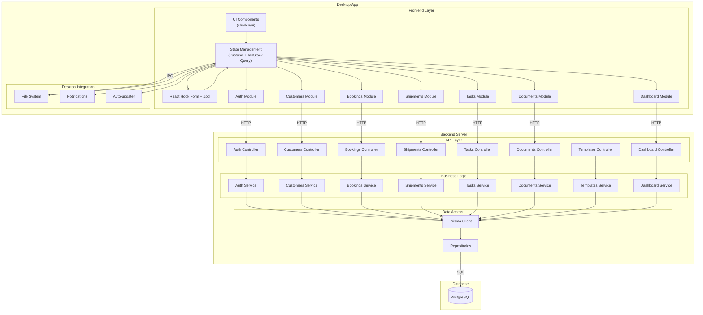
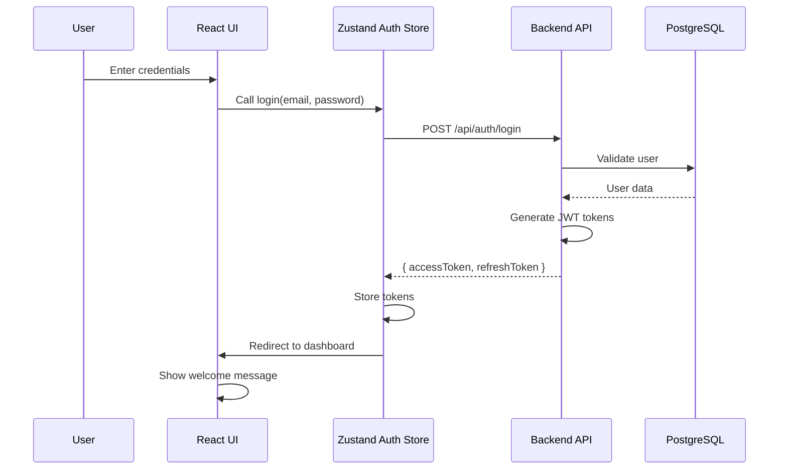
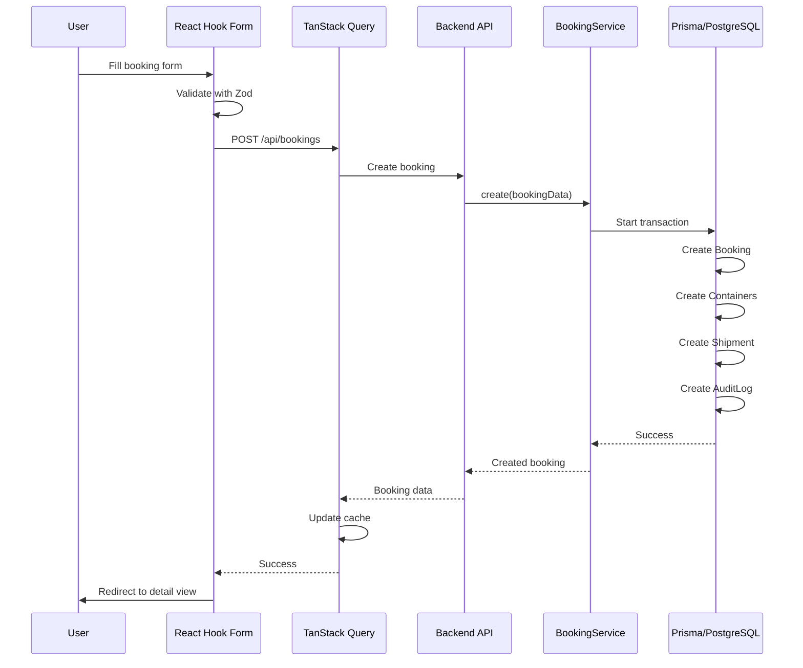
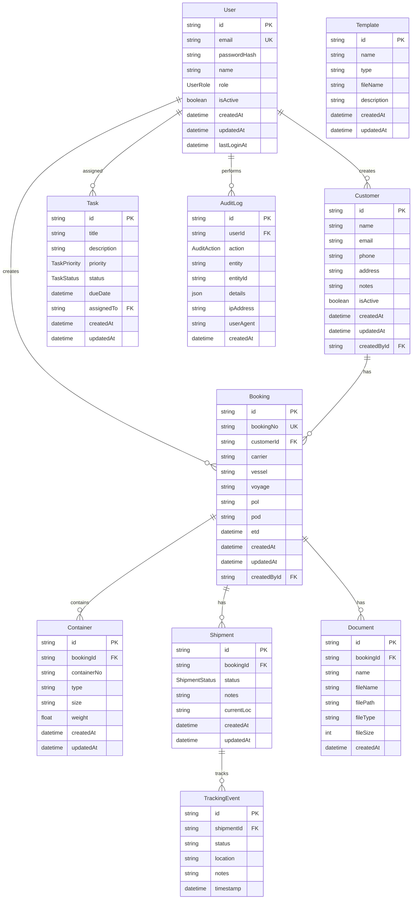
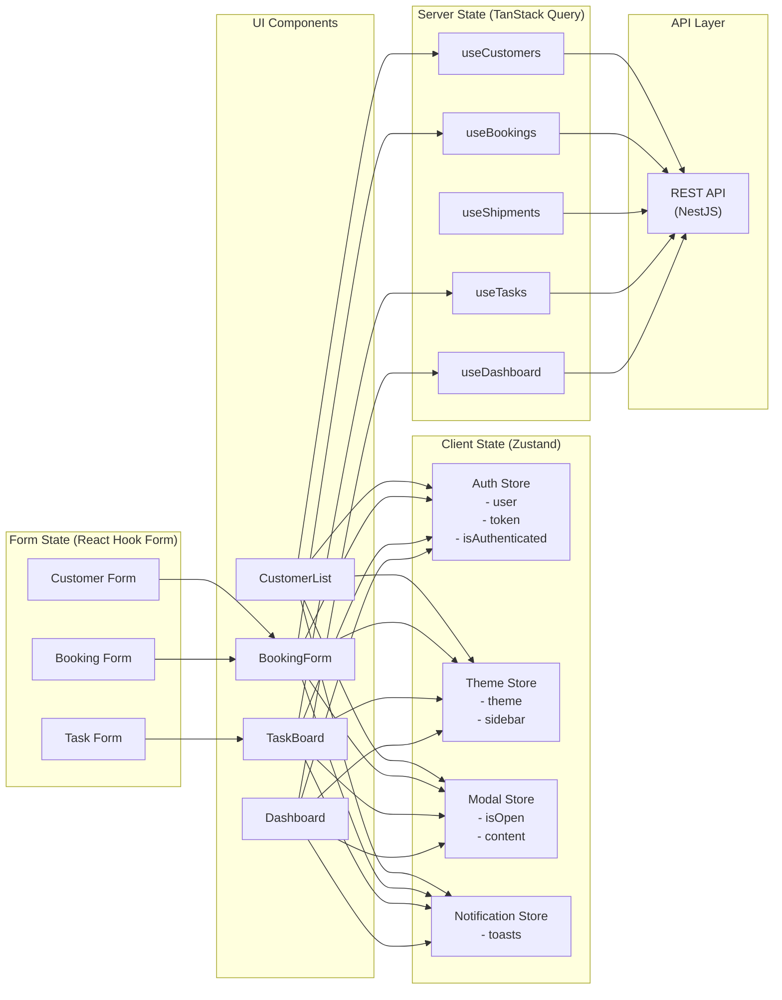
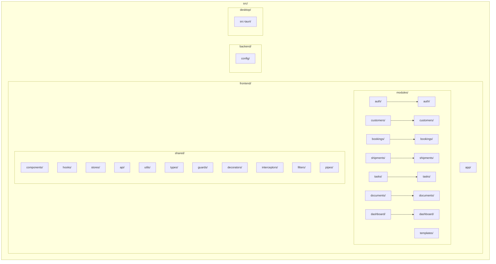
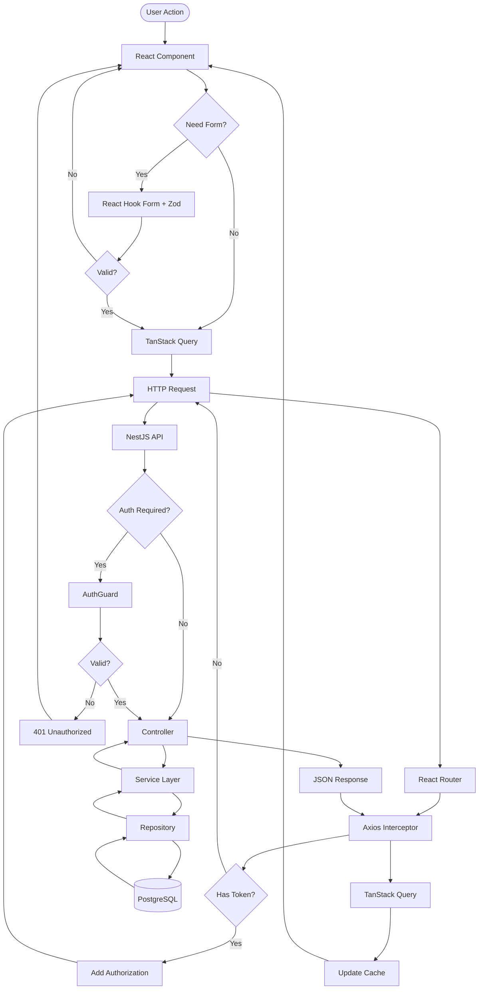

# sea-net-desktop-v2 - Architecture Diagrams

## Mermaid Diagrams

### 1. High-Level System Architecture


### 2. Authentication Flow


### 3. Booking Creation Flow


### 4. Database Schema Relationships


### 5. State Management Architecture


### 6. Module Structure


### 7. API Request Flow


### 8. File System Structure
```
sea-net-desktop-v2/
├── frontend/                    # React + Vite
│   ├── src/
│   │   ├── modules/
│   │   │   ├── auth/
│   │   │   │   ├── components/
│   │   │   │   ├── hooks/
│   │   │   │   ├── types.ts
│   │   │   │   └── index.ts
│   │   │   ├── customers/
│   │   │   │   ├── components/
│   │   │   │   │   ├── CustomerList.tsx
│   │   │   │   │   ├── CustomerForm.tsx
│   │   │   │   │   └── CustomerDetail.tsx
│   │   │   │   ├── hooks/
│   │   │   │   │   ├── useCustomers.ts
│   │   │   │   │   └── useCustomer.ts
│   │   │   │   ├── types.ts
│   │   │   │   └── index.ts
│   │   │   ├── bookings/
│   │   │   │   ├── components/
│   │   │   │   │   ├── BookingList.tsx
│   │   │   │   │   ├── BookingForm.tsx
│   │   │   │   │   ├── BookingDetail.tsx
│   │   │   │   │   └── ContainerForm.tsx
│   │   │   │   ├── hooks/
│   │   │   │   │   ├── useBookings.ts
│   │   │   │   │   └── useBooking.ts
│   │   │   │   ├── types.ts
│   │   │   │   └── index.ts
│   │   │   ├── shipments/
│   │   │   │   ├── components/
│   │   │   │   │   ├── ShipmentList.tsx
│   │   │   │   │   ├── ShipmentDetail.tsx
│   │   │   │   │   ├── TrackingTimeline.tsx
│   │   │   │   │   └── StatusUpdateForm.tsx
│   │   │   │   ├── hooks/
│   │   │   │   │   ├── useShipments.ts
│   │   │   │   │   └── useShipment.ts
│   │   │   │   ├── types.ts
│   │   │   │   └── index.ts
│   │   │   ├── tasks/
│   │   │   │   ├── components/
│   │   │   │   │   ├── TaskBoard.tsx
│   │   │   │   │   ├── TaskForm.tsx
│   │   │   │   │   └── TaskCard.tsx
│   │   │   │   ├── hooks/
│   │   │   │   │   ├── useTasks.ts
│   │   │   │   │   └── useTask.ts
│   │   │   │   ├── types.ts
│   │   │   │   └── index.ts
│   │   │   ├── documents/
│   │   │   │   ├── components/
│   │   │   │   │   ├── DocumentList.tsx
│   │   │   │   │   ├── UploadForm.tsx
│   │   │   │   │   └── DocumentPreview.tsx
│   │   │   │   ├── hooks/
│   │   │   │   │   ├── useDocuments.ts
│   │   │   │   │   └── useDocument.ts
│   │   │   │   ├── types.ts
│   │   │   │   └── index.ts
│   │   │   ├── templates/
│   │   │   │   ├── components/
│   │   │   │   │   ├── TemplateList.tsx
│   │   │   │   │   ├── TemplateForm.tsx
│   │   │   │   │   └── TemplatePreview.tsx
│   │   │   │   ├── hooks/
│   │   │   │   │   ├── useTemplates.ts
│   │   │   │   │   └── useTemplate.ts
│   │   │   │   ├── types.ts
│   │   │   │   └── index.ts
│   │   │   └── dashboard/
│   │   │       ├── components/
│   │   │       │   ├── StatsCards.tsx
│   │   │       │   ├── RecentActivity.tsx
│   │   │       │   ├── BookingChart.tsx
│   │   │       │   └── ShipmentStatusChart.tsx
│   │   │       ├── hooks/
│   │   │       │   ├── useDashboard.ts
│   │   │       │   └── useStats.ts
│   │   │       ├── types.ts
│   │   │       └── index.ts
│   │   ├── shared/
│   │   │   ├── components/
│   │   │   │   ├── ui/           # shadcn/ui components
│   │   │   │   ├── layout/
│   │   │   │   │   ├── Header.tsx
│   │   │   │   │   ├── Sidebar.tsx
│   │   │   │   │   └── Layout.tsx
│   │   │   │   └── common/
│   │   │   │       ├── Button.tsx
│   │   │   │       ├── Input.tsx
│   │   │   │       ├── DataTable.tsx
│   │   │   │       ├── SearchInput.tsx
│   │   │   │       ├── LoadingSpinner.tsx
│   │   │   │       └── ErrorBoundary.tsx
│   │   │   ├── hooks/
│   │   │   │   ├── useAuth.ts
│   │   │   │   ├── useToast.ts
│   │   │   │   ├── useModal.ts
│   │   │   │   └── useKeyboardShortcuts.ts
│   │   │   ├── stores/
│   │   │   │   ├── authStore.ts
│   │   │   │   ├── themeStore.ts
│   │   │   │   ├── modalStore.ts
│   │   │   │   └── notificationStore.ts
│   │   │   ├── api/
│   │   │   │   ├── axios.ts
│   │   │   │   ├── endpoints.ts
│   │   │   │   └── client.ts
│   │   │   ├── utils/
│   │   │   │   ├── date.ts
│   │   │   │   ├── format.ts
│   │   │   │   ├── validation.ts
│   │   │   │   └── export.ts
│   │   │   └── types/
│   │   │       ├── global.ts
│   │   │       ├── api.ts
│   │   │       └── pagination.ts
│   │   └── app/
│   │       ├── App.tsx
│   │       ├── main.tsx
│   │       ├── router.tsx
│   │       └── styles.css
│   ├── index.html
│   ├── vite.config.ts
│   ├── tailwind.config.js
│   └── package.json
│
├── backend/                     # NestJS
│   ├── src/
│   │   ├── modules/
│   │   │   ├── auth/
│   │   │   │   ├── auth.controller.ts
│   │   │   │   ├── auth.service.ts
│   │   │   │   ├── auth.module.ts
│   │   │   │   ├── dto/
│   │   │   │   ├── guards/
│   │   │   │   └── strategies/
│   │   │   ├── customers/
│   │   │   │   ├── customers.controller.ts
│   │   │   │   ├── customers.service.ts
│   │   │   │   ├── customers.module.ts
│   │   │   │   └── dto/
│   │   │   ├── bookings/
│   │   │   │   ├── bookings.controller.ts
│   │   │   │   ├── bookings.service.ts
│   │   │   │   ├── bookings.module.ts
│   │   │   │   └── dto/
│   │   │   ├── shipments/
│   │   │   │   ├── shipments.controller.ts
│   │   │   │   ├── shipments.service.ts
│   │   │   │   ├── shipments.module.ts
│   │   │   │   └── dto/
│   │   │   ├── tasks/
│   │   │   │   ├── tasks.controller.ts
│   │   │   │   ├── tasks.service.ts
│   │   │   │   ├── tasks.module.ts
│   │   │   │   └── dto/
│   │   │   ├── documents/
│   │   │   │   ├── documents.controller.ts
│   │   │   │   ├── documents.service.ts
│   │   │   │   ├── documents.module.ts
│   │   │   │   └── dto/
│   │   │   ├── templates/
│   │   │   │   ├── templates.controller.ts
│   │   │   │   ├── templates.service.ts
│   │   │   │   ├── templates.module.ts
│   │   │   │   └── dto/
│   │   │   └── dashboard/
│   │   │       ├── dashboard.controller.ts
│   │   │       ├── dashboard.service.ts
│   │   │       ├── dashboard.module.ts
│   │   │       └── dto/
│   │   ├── shared/
│   │   │   ├── guards/
│   │   │   │   ├── jwt-auth.guard.ts
│   │   │   │   ├── roles.guard.ts
│   │   │   │   └── resource.guard.ts
│   │   │   ├── decorators/
│   │   │   │   ├── roles.decorator.ts
│   │   │   │   └── public.decorator.ts
│   │   │   ├── interceptors/
│   │   │   │   ├── logging.interceptor.ts
│   │   │   │   └── transform.interceptor.ts
│   │   │   ├── filters/
│   │   │   │   ├── all-exceptions.filter.ts
│   │   │   │   └── validation-exception.filter.ts
│   │   │   ├── pipes/
│   │   │   │   └── validation.pipe.ts
│   │   │   └── utils/
│   │   ├── config/
│   │   │   ├── database.config.ts
│   │   │   ├── jwt.config.ts
│   │   │   └── app.config.ts
│   │   ├── app.module.ts
│   │   └── main.ts
│   ├── prisma/
│   │   ├── schema.prisma
│   │   └── migrations/
│   ├── nest-cli.json
│   └── package.json
│
├── desktop/                     # Tauri
│   ├── src-tauri/
│   │   ├── src/
│   │   │   ├── lib.rs
│   │   │   └── main.rs
│   │   ├── Cargo.toml
│   │   ├── tauri.conf.json
│   │   └── icons/
│   └── src/
│
├── .github/
│   └── workflows/
│       ├── ci.yml
│       └── cd.yml
│
├── README.md
├── .gitignore
└── docker-compose.yml
```

---

*Generated: 2026-02-03*
*Author: Senior Fullstack AI Agent*
